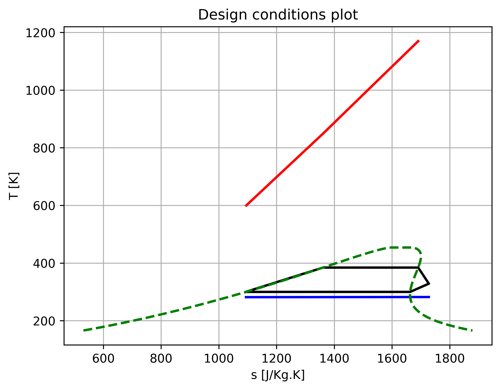
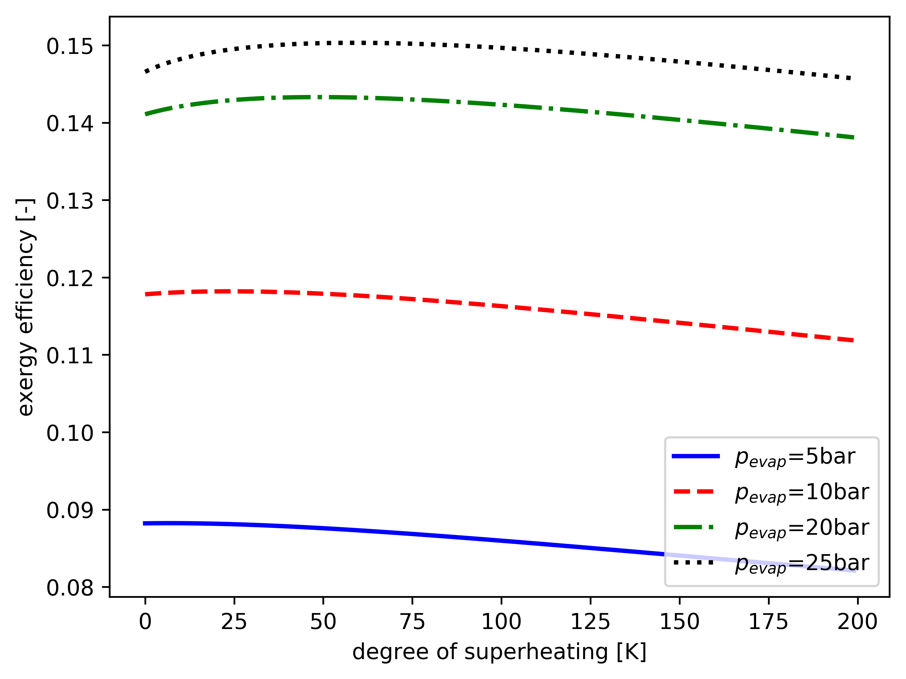
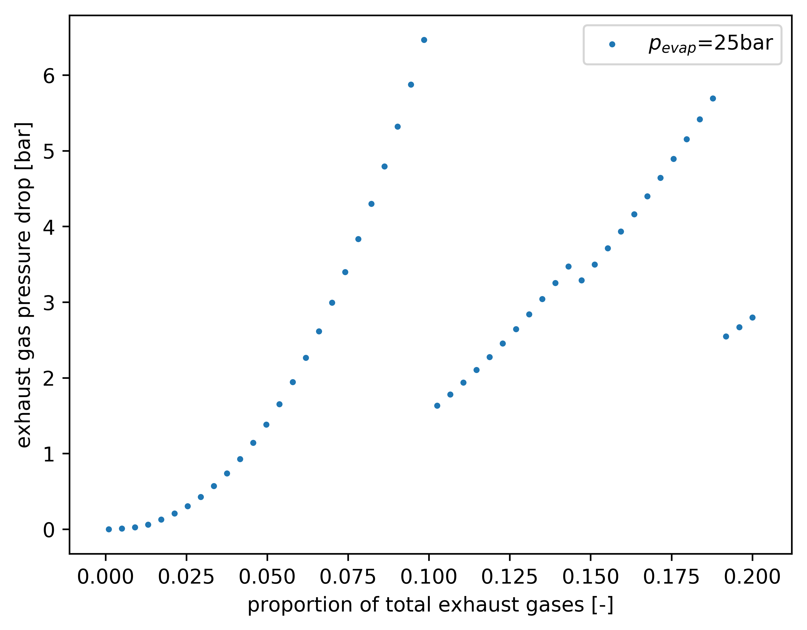

Basic organic Rankine cycle with a corrugated-plate evaporator
======================================================================

.. contents::

This example is found in examples/hughes2017 and is an update to the analysis found in the paper *On the potential of organic Rankine cycles for recovering waste heat from the exhaust gases of a piston aero-engine* by Hughes and Olsen, presented at Asia-Pacific Symposium on Aerospace Technology 2017, Seoul, Korea (`hyperlink <https://www.unsworks.unsw.edu.au/primo-explore/fulldisplay?docid=unsworks_modsunsworks_47631&context=L&vid=UNSWORKS&search_scope=unsworks_search_scope&tab=default_tab&lang=en_US>`_) [Hughes2017]_.

The first section of the script imports the required modules and sets up the default formatting for the plots and some custom formatting for matplotlib.::

    >>> import mcycle as mc
    >>> import os
    >>> import numpy as np
    >>> import CoolProp as CP
    >>> import matplotlib as mpl
    >>> import matplotlib.pyplot as plt

    >>> mc.defaults.PLOT_DIR = 'plots'
    >>> mc.defaults.PLOT_FORMAT = "png"  # change to "jpg" if preferred
    >>> mc.defaults.PLOT_DPI = 600
    >>> mc.updateDefaults()plots_folder = "plots"
    
    >>> mpl.rc("lines", lw=2.0)
    >>> mpl.rc("lines", markersize=2)
    >>> colours = ["blue", "red", "green", "black"]
    >>> linestyles = ["-", "--", "-.", ":"]
    >>> markerstyles = ["o", "v", "s", "^"]

Setting up the default characteristics of the cycle
-------------------------------------------------------------

Working fluid
**********************************************

Refrigerant R123 (using CoolProp's HEOS backend by default).::

    >>> wf = mc.FlowState("R123")

Heat source
**********************************************

The exhaust flow from the engine is approximated using the following characteristics.

- :math:`N_2` (75%), :math:`C0_2` (25%) (by molar fraction)
- :math:`p_{static} = 1.116` bar
- :math:`T_{static} = 1170` K
- :math:`\dot{m} = 0.09` Kg/s

As CoolProp can have difficulties with mixtures, we instead use FlowStatePoly for the exhaust gasses; fitting a 2nd degree polynomial to the properties of the exhaust mixture evaluated at 300, 500, 700, 900 and 1170 K::

    >>> TData = [300, 500, 700, 900, 1170.]
    >>> sourceRefData = mc.RefData(sourceFluid, 2, sourceIn_p, {'T': TData}, phaseCP=CP.iphase_gas)
    >>> sourceIn = mc.FlowStatePoly(sourceRefData, 0.09, CP.PT_INPUTS, sourceIn_p, sourceIn_T)

Ambient air/ heat sink
**********************************************

Assuming the engine is travelling at 100knots at an altitude of 3000ft, the ambient air is approximated using the following characteristics.

- Air (100%)
- :math:`p_{static} = 0.8826` bar
- :math:`T_{static} = 281.65` K

::

    >>> sinkIn = mc.FlowState("Air", -1, -1, CP.PT_INPUTS, 0.88260e5, 281.65)

The dead state/ ambient properties of the source and sink are at this same pressure and temperature.::

    >>> sinkAmbient = sinkIn.copy()
    >>> sourceAmbient = mc.FlowState(sourceFluid, CP.iphase_gas, -1, CP.PT_INPUTS, 0.88260e5, 281.65)

Evaporator and condenser
**********************************************

For the evaporator, we used a AlfaLaval AC30EQ model corrugated plate heat exchanger.::

    >>> evap = mc.library.alfaLaval_AC30EQ(sizeAttr="NPlate")

As sizing the condenser is not central to this analysis, it is treated simply as a heat sink.::

    >>> cond = mc.ClrBasic(constraint=mc.CONSTANT_P, -1, 1, sizeAttr="Q")

Compressor and expander
**********************************************

Equally, sizing of the compressor and expander is beyond the scope of this analysis. Here, it is simply assumed that they both have an isentropic efficiency of 70%.::

    >>> comp = mc.CompBasic(-1, 0.7, sizeAttr="pRatio")
    >>> exp = mc.ExpBasic(-1, 0.7, sizeAttr="pRatio")

Design parameters
**********************************************

As default design parameters, we use:

- :math:`p_{evap} = 10` bar
- :math:`T_{cond} = 300` K
- No superheating
- No subcooling

::

    >>> pEvap = 10e5
    >>> TCond = 300
    >>> superheat = 0
    >>> subcool = 0

For this analysis, we calculate the pressure drops in he evaporator but will not update the flows to reflect these. Additionally, we only consider frictional pressure drops: acceleration, port and head pressure drops are relatively small and hence we neglect them. We will also set the heat transfer methods that we will useThe cycle configuration parameters are hence created:::

    >>> config = mc.Config()
    >>> config.update({
            'dpEvap': False,
            'dpCond': False,
            'dpF': True,
            'dpAcc': False,
            'dpPort': False,
            'dpHead': False})
    >>> config.set_method("chisholmWannairachchi_sp", ["GeomHxPlateCorrChevron"], ["all"], ["all-sp"], ["wf"])
    >>> config.set_method("yanLin_tpEvap", ["GeomHxPlateCorrChevron"], ["all"], ["tpEvap"], ["wf"])
    >>> config.set_method("savostinTikhonov_sp", ["GeomHxPlateCorrChevron"], ["all"], ["all-sp"], ["sf"])

Finally, we can create the RankineBasic object, parsing each of the above components.::

    >>> cycle = mc.RankineBasic(wf, evap, exp, cond, comp, pEvap, superheat, nan, subcool, config)
    >>> cycle.update({
            'TCond': TCond,
            'sourceIn': sourceIn,
            'sourceAmbient': sourceAmbient})

.. note:: The ``update()`` method is used for ``TCond``, ``sourceIn``, ``sourceAmbient`` as these are all properties of the ``RankineBasic`` class, thus parsing them as keyword arguments calls their setter which ensures all relelvant properties and component flows are updated. 

Design conditions temperature-entropy plot
**********************************************

For the purpose of producing a nicer plot of the cycle at design conditions, we temporarily change the condenser to a heat exchanger so that a sink flow line appears on the plot (:meth:`ClrBasic <mcycle.components.coolers.clr_basic.ClrBasic>` objects do not show up in plot as they do not have a defined temperature. We replace the condenser with a heat exchanger and set the sink flow mass flow rate high to approximate a constant temperature sink.::

    >>> cycle.update({'cond': mc.library.alfaLaval_CBXP27(), 'pptdEvap': 300, 'sinkIn': sinkIn, 'sinkIn.m': 100.})

Next, we must set up the cycle to the design conditions which we can do using :meth:`size() <mcycle.cycles.rankinebasic.RankineBasic.size>`::

    >>> cycle.sizeSetup(False, False)

After calling :meth:`plot() <mcycle.cycles.rankinebasic.RankineBasic.plot>`, the following plot is produced.

Superheating analysis
----------------------

To study the effects of superheating on the cycle efficiency, we vary the degree of superheating from 0 to 200 K for various evaporating pressures. Here we keep the condensing temperature constant at 300 K, as well as the pinch-point temperature difference in the evaporator constant at 20 K.::

    >>> pptdEvap = 20.  # K
    >>> p_vals = [5, 10, 20, 25]  # bar
    >>> superheat_vals = [range(0, 200)] * len(p_vals)  # K
    >>> plot_eff, plot_Pnet = [], [] # lists to store results
    >>> for i in range(len(p_vals)):
            plot_eff.append([])
            plot_Pnet.append([])
            cycle.update({'pEvap': p_vals[i] * 10**5})
            for superheat in superheat_vals[i]:
                cycle.update({'superheat': superheat, 'pptdEvap': pptdEvap})
                cycle.sizeSetup(False, False)
                plot_eff[i].append(cycle.effExergy())
                plot_Pnet[i].append(cycle.PNet() / 1000)  # kW

This produces the following plots.

.. figure:: plots/hughes2017_superheat_Pnet.png
   :alt: Effect of superheating on net power output.
   :height: 200px

Pinch-point temperature difference analysis
----------------------------------------------

Next, we study the effects of the evaporator pinch-point temperature difference on the exergy efficiency, required number of plates and pressure drop of the working fluid. Superheating is set to 0 K and evaporating pressure is varied from 5 to 25 bar.::

    >>> cycle.config.update(dpAccWf=True, dpHeadWf=True, dpPortWf=True)
    >>> cycle.superheat = 0.  # K
    >>> p_vals = [5, 10, 20, 25]  # bar
    >>> pptd_vals = [np.logspace(1, np.log10(200), 40)] * len(p_vals)  # K
    >>> plot_eff, plot_NPlate, plot_weight, plot_dpWf = [], [], [], []
    >>> for i in range(len(p_vals)):
            plot_eff.append([])
            plot_NPlate.append([])
            plot_weight.append([])
            plot_dpWf.append([])
            cycle.update({'pEvap': p_vals[i] * 10**5})
            NPlateLowerBound = 3
            for pptd in pptd_vals[i]:
                cycle.update({'pptdEvap': pptd, 'evap.L': mc.library.alfaLaval_AC30EQ().L})
                cycle.sizeSetup(False, False)
                cycle.evap._size("NPlate", [NPlateLowerBound, cycle.evap.sizeBounds[1]], [])
                plot_eff[i].append(cycle.effExergy())
                plot_NPlate[i].append(cycle.evap.NPlate)
                plot_weight[i].append(cycle.evap.weight())
                plot_dpWf[i].append(cycle.evap.dpWf() / (10**5))
                NPlateLowerBound = max(3, cycle.evap.NPlate - 2)

This produces the following plots.

.. figure:: plots/hughes2017_pptd_eff.png
   :alt: Effect of PPTD on exergy efficiency.
   :height: 200px

.. figure:: plots/hughes2017_pptd_NPlate.png
   :alt: Effect of PPTD on required no. of plates and exchanger weight.
   :height: 200px

.. figure:: plots/hughes2017_pptd_dpWf.png
   :alt: Effect of PPTD on working fluid evaporator pressure drop.
   :height: 200px

Evaporating pressure analysis
----------------------------------------------

We now move on to studying the effects of the working fluid evaporating pressure on the pressure drops in the working fluid and exhaust gasses. Pinch-point temperature difference is kept constant at 10 K and superheating at 0 K.::

    >>> cycle.superheat = 0.
    >>> p_vals = np.linspace(5, 25, 50, True)
    >>> plot_NPlate, plot_dpWf, plot_dpSf = [], [], []
    >>> NPlateLowerBound = 3
    >>> for i in range(len(p_vals)):
            cycle.update({'pEvap': p_vals[i] * 10**5, 'pptdEvap': 10.})
            cycle.sizeSetup(True, False)
            cycle.evap.update({'L': mc.library.alfaLaval_AC30EQ().L, 'sizeBounds[0]': NPlateLowerBound})
            cycle.evap.size_NPlate()
            plot_NPlate.append(cycle.evap.NPlate)
            plot_dpWf.append(cycle.evap.dpWf() / (10**5))
            plot_dpSf.append(cycle.evap.dpSf() / (10**5))
            NPlateLowerBound = cycle.evap.NPlate - 1

This produces the following plots.

.. figure:: plots/hughes2017_pressure_dpWf.png
   :alt: Effect of evaporating pressure on working fluid evaporator pressure drop.
   :height: 200px

.. figure:: plots/hughes2017_pressure_dpSf.png
   :alt: Effect of evaporating pressure on exhaust gas pressure drop.
   :height: 200px

Exhaust gas mass flow rate analysis
----------------------------------------------

Finally, we study the effect of the mass flow rate of the exhaust gasses on their pressure drop in the evaporator. Here we keep the evaporator pinch-point temperature difference constant at 10 K and the evaporating pressure of the working fluid constant at 25 bar::

    >>> superheat = 0.
    >>> pEvap = 25
    >>> pptdEvap = 10.
    >>> fraction_vals = np.linspace(0.001, 0.2)
    >>> plot_dpSf = []
    >>> cycle.update({'superheat': superheat, 'pEvap': pEvap * 1e5})
    >>> mSource = cycle.evap.mSf
    >>> NPlateLowerBound = 3
    >>> for frac in fraction_vals:
            cycle.evap.mSf = mSource * frac
            cycle.update({'pptdEvap': pptdEvap})
            cycle.evap.update({'L': mc.library.alfaLaval_AC30EQ().L, 'sizeBounds[0]': NPlateLowerBound})
            cycle.sizeSetup(True, False)
            cycle.evap.size_NPlate()
            plot_dpSf.append(cycle.evap.dpSf() / (10**5))
            NPlateLowerBound = cycle.evap.NPlate

This produces the following plot.

Differences from Hughes and Olsen (2017) paper
-----------------------------------------------

Slight differences between the results presented above and the results in [Hughes2017]_ arise for the following reasons.

- This analysis approximates the exhaust gas properties using a quadratic line of best fit based on the properties evaluated at 300, 500, 700, 900 & 1170 K, whereas the original paper used a linear line of best fit based of the properties evaluated at 900 & 1170 K.
- This analysis takes into account the port, acceleration and static head pressure drops whereas the original paper neglected these.
- The `size_NPlate` algorithm of HxPlateCorrugated in this analysis sizes for `NPlate` that gives `L` closest to the desired heat transfer length, whereas the algorithm in the original paper sized for `L` closest to but less than the desired heat transfer length.

References
----------------

.. [Hughes2017] Hughes, M., Olsen, J., *On the potential of organic Rankine cycles for recovering waste heat from the exhaust gases of a piston aero-engine*, Asia-Pacific International Symposium on Aerospace Technology, Seoul, Korea, 2017.

This paper can be found at `this link <https://www.unsworks.unsw.edu.au/primo-explore/fulldisplay?docid=unsworks_modsunsworks_47631&context=L&vid=UNSWORKS&search_scope=unsworks_search_scope&tab=default_tab&lang=en_US>`_ and can be cited using the following reference.::

    @InProceedings{hughes2017potential,
        author    = {Hughes, Momar Graham-Orr and Olsen, John},
        title     = {On the potential of organic Rankine cycles for recovering waste heat from the exhaust gases of a piston aero-engine},
        booktitle = {Proceedings of the 2017 Asia-Pacific International Symposium on Aerospace Technology; October 16-18; Seoul; Korea},
        year      = {2017},
        pages     = {1876--1883},
        keywords  = {Aircraft engine, Organic Rankine cycle, Waste heat recovery, Plate heat exchanger},
        url = {\\url{https://www.unsworks.unsw.edu.au/primo-explore/fulldisplay?docid=unsworks_modsunsworks_47631&context=L&vid=UNSWORKS&search_scope=unsworks_search_scope&tab=default_tab&lang=en_US}}
    }

Source code
----------------

.. literalinclude:: ../../examples/hughes2017/hughes2017.py
