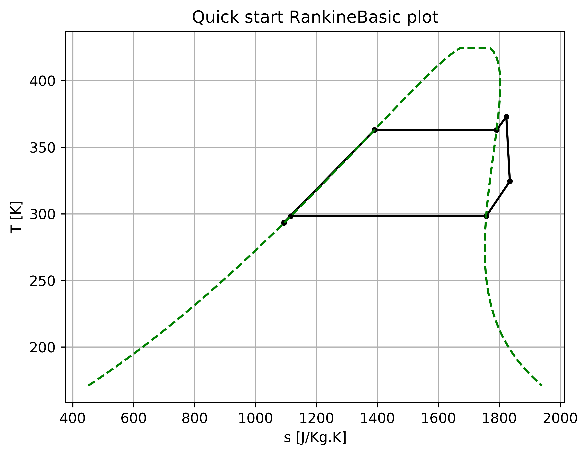
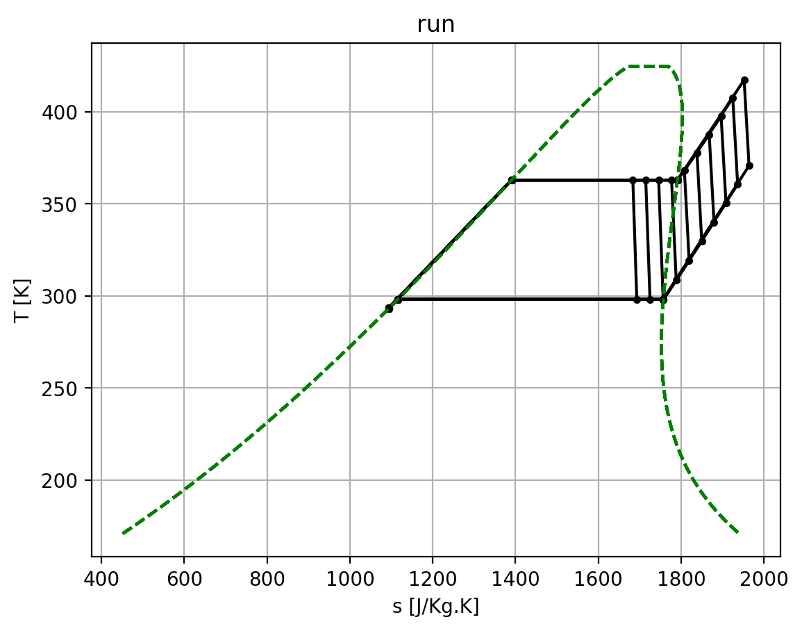

Quick start example of basic MCycle features
================================================

.. contents::

This quickstart example goes through creating a basic organic Rankine cycle and demonstrates some basic MCycle functions, including:

  - setting MCycle defaults,
  - creating flowstates, components and cycles,
  - plotting a cycle,
  - printing a cycle summary
  - using the ``size`` and ``run`` methods to analyse a component

This script should be copied and run from your local directory. Keyword arguments have been specified throughout this example for clarity however in practice these are not strictly required.

Setting up MCycle
-------------------------------------------------------------

Having correctly installed MCycle from either the source code or pip (:ref:`see installation notes <section-README-installation>`), MCycle and CoolProp must first be imported.::

    >>> import mcycle as mc
    >>> import CoolProp as CP

Next, we change a couple of the MCycle defaults to our liking. The :meth:`check() <mcycle.defaults.check>` function should be executed after changing defaults to ensure the new value is valid and to run any required backend functions to register the change.

    >>> mc.defaults.PLOT_DIR = "" # will not create a new folder for plots
    >>> mc.defaults.PLOT_DPI = 200
    >>> mc.defaults.check()

Creating flowstates
-------------------------------------------------------------

To represent the working fluid of the cycle, we must create a :meth:`FlowState object <mcycle.bases.flowstate.FlowState>`. The mass flow rate and initial state conditions do not need to be defined, as they will be set later by the cycle parameters, but for the sake of demonstrating the full constructor, we can assign some arbitrary values. Note that ``iphase = PHASE_NOT_IMPOSED`` is used when the flow phase does not explicitly need to be defined. FlowState objects will use the CoolProp backend specified by the :meth:`defaults.COOLPROP_EOS <mcycle.defaults.COOLPROP_EOS>` attribute, which defaults to ``"HEOS"``.

    >>> wf = mc.FlowState(fluid="R245fa", m=1.0, inputPair=mc.PT_INPUTS, input1=mc.atm2Pa(1), input2=298, iphase=mc.PHASE_NOT_IMPOSED)

Printing flowstate summaries
******************************

The :meth:`summary() <mcycle.bases.flowstate.FlowState.summary>` method is quick way to print a customisable summary of a flowstate.

    >>> wf.summary(title='Working fluid')
    Working fluid summary
    =====================
    T() = 2.9800e+02 [K]
    p() = 1.0132e+05 [Pa]
    rho() = 5.6918e+00 [Kg/m^3]
    h() = 4.2539e+05 [J/Kg]
    s() = 1.7835e+03 [J/Kg.K]
    cp() = 8.8817e+02 [J/Kg.K]
    visc() = 1.1810e-05 [N.s/m^2]
    k() = 1.5704e-02 [W/m.K]
    Pr() = 6.6798e-01
    x() = -1.0000e+00

Creating components
-------------------------------------------------------------

Before creating the cycle, we must create the individual :meth:`Component objects <mcycle.bases.component>`. An organic Rankine cycle requires an expander, condenser, compressor and evaporator. For this example we will use the most basic models for each component. Again, many of the attributes will be set later by the cycle parameters, including the incoming and outgoing flowstates, but we will assign some of them arbitrary values here for demonstration purposes.

    >>> exp = mc.ExpBasic(pRatio=1, efficiencyIsentropic=0.9, sizeAttr="pRatio")
    >>> cond = mc.ClrBasicConstP(QCool=1, efficiencyThermal=1.0, sizeAttr="Q")
    >>> comp = mc.CompBasic(pRatio=1, efficiencyIsentropic=0.85, sizeAttr="pRatio")
    >>> evap = mc.HtrBasicConstP(QHeat=1, efficiencyThermal=1.0, sizeAttr="Q")

Printing component summaries
******************************

The :meth:`summary() <mcycle.bases.component.Component.summary>` method is quick way to print a customisable summary of a component. As the components do not have flowstates yet, we will not include information for any flowstates in the summary.

    >>> exp.summary(propertyKeys='all', flowKeys='all', title="Expander")
    Expander summary
    ================
    Notes: No notes/model info.
    pRatio = 1.0000e+00
    effIsentropic = 9.0000e-01
    ambient = None
    
    Expander properties
    -------------------
    mWf not yet defined
    pIn not yet defined
    pOut not yet defined
    POut() = 0.0000e+00 [W]

    flowInWf summary
    ------------------
    flowstate not defined

    flowOutWf summary
    ------------------
    flowstate not defined

Creating cycles
-------------------------------------------------------------

The :meth:`RankineBasic <mcycle.cycles.rankinebasic.RankineBasic>` object can now be created. We will also define the design cycle parameters which are required by the :meth:`size() <mcycle.cycles.rankinebasic.RankineBasic.size>` method. As the condensing temperature :meth:`TCond() <mcycle.cycles.rankinebasic.RankineBasic.TCond>` is a property computed from the condesing pressure, we define it after constructing the cycle using the :meth:`update() <mcycle.cycles.rankinebasic.RankineBasic.update>` method. We will use the default :meth:`Config <mcycle.defaults.CONFIG>` by not specifying ``config`` in the constructor (we could also set it to the value ``None``).

    >>> cycle = mc.RankineBasic(wf=wf, evap=evap, exp=exp, cond=cond, comp=comp, config=None)
    >>> cycle.update({"pEvap": mc.bar2Pa(10), "superheat": 10., "TCond": mc.degC2K(25), "subcool": 5.})

Plotting cycles
-------------------------------------------------------------

With the cycle and its components now set up, we can start by plotting the cycle at the design conditions on a temperature-entropy diagram using the  :meth:`plot() <mcycle.cycles.rankinebasic.RankineBasic.plot>` method. Currently, the cycle has been constructed, but the flowstates of the cycle components still have not been initialised. Although the :meth:`size() <mcycle.cycles.rankinebasic.RankineBasic.size>` method takes care of this, with more complex cycle components, this method may be time-consuming. As a shortcut, the :meth:`sizeSetup() <mcycle.cycles.rankinebasic.RankineBasic.sizeSetup>` method was created, which initialises all cycle flowstates to design conditions, but does not proceed to size each of the components. We will also specify not to unitise the evaporator or condenser, although for this example this would not occur anyway as we have not used components that require unitisation.

    >>> cycle.sizeSetup(unitiseEvap=False, unitiseCond=False)
    >>> cycle.plot(graph='Ts', # either 'Ts' or 'ph'
                   title='Quick start RankineBasic plot', # graph title
                   satCurve=True, # display saturation curve
                   newFig=True, # create a new figure
                   show=False, # show the figure
                   savefig=True, # save the figure
                   savefig_name='quickstart_plot_RankineBasic',
                   plot_folder='')

This produces the following graph.

Printing cycle summaries
-------------------------------------------------------------

Although plotting the cycle is a great visual representation of the cycle, often a more in depth summary is required. Here we will size the cycle to the design parameters and print a complete summary of the cycle. The :meth:`size() <mcycle.cycles.rankinebasic.RankineBasic.size>` method, as mentioned above, calls the :meth:`size() <mcycle.bases.components.size>` method of each component of the cycle. The ``sizeAttr`` attribute determines which component attribute will be sized, while the ``sizeBounds`` attribute defines the bounds containing the solution (not all components require this for their ``size()`` method). For now, we will use the default values for each of the cycle components.

    >>> cycle.size()

Now, to print the cycle summary, we simply use the :meth:`summary() <mcycle.cycles.rankinebasic.RankineBasic.summary>` method, selecting to print all cycle component and flowstate summaries.

    >>> cycle.summary(printSummary=True, propertyKeys='all', cycleStateKeys='all', componentKeys='all', title="Quick start RankineBasic cycle")

This prints the following output in rST format::

    Quick start RankineBasic cycle summary
    ======================================
    working fluid: R245fa
    pEvap = 1.0000e+06 [Pa]
    superheat = 1.0000e+01 [K]
    pCond = 1.4858e+05 [Pa]
    subcool = 5.0000e+00 [K]
    
    Properties
    ----------
    mWf = 1.0000e+00 [Kg/s]
    QIn() = 2.5446e+05 [W]
    QOut() = 2.2194e+05 [W]
    PIn() = 7.4039e+02 [W]
    POut() = 3.3256e+04 [W]
    effThermal() = 1.2778e-01
    effExergy() = nan
    IComp() = nan [W]
    IEvap() = nan [W]
    IExp() = nan [W]
    ICond() = nan [W]
    
    evap summary
    ------------
    Notes: No notes/model info.
    Q = 2.5446e+05 [W]
    effThermal = 1.0000e+00
    ambient = None
    
    exp summary
    -----------
    Notes: No notes/model info.
    pRatio = 6.7303e+00
    effIsentropic = 9.0000e-01
    ambient = None
    
    cond summary
    ------------
    Notes: No notes/model info.
    Q = 2.2194e+05 [W]
    effThermal = 1.0000e+00
    ambient = None
    
    comp summary
    ------------
    Notes: No notes/model info.
    pRatio = 6.7303e+00
    effIsentropic = 8.5000e-01
    ambient = None
    
    state1 summary
    --------------
    T() = 2.9351e+02 [K]
    p() = 1.0000e+06 [Pa]
    rho() = 1.3535e+03 [Kg/m^3]
    h() = 2.2717e+05 [J/Kg]
    s() = 1.0937e+03 [J/Kg.K]
    cp() = 1.3031e+03 [J/Kg.K]
    visc() = 4.2221e-04 [N.s/m^2]
    k() = 9.3756e-02 [W/m.K]
    Pr() = 5.8684e+00
    x() = -1.0000e+00
    
    state20 summary
    ---------------
    T() = 3.6290e+02 [K]
    p() = 1.0000e+06 [Pa]
    rho() = 1.1347e+03 [Kg/m^3]
    h() = 3.2443e+05 [J/Kg]
    s() = 1.3903e+03 [J/Kg.K]
    cp() = 1.5345e+03 [J/Kg.K]
    visc() = 1.8747e-04 [N.s/m^2]
    k() = 7.3074e-02 [W/m.K]
    Pr() = 3.9368e+00
    x() = 0.0000e+00

    state21 summary
    ---------------
    T() = 3.6290e+02 [K]
    p() = 1.0000e+06 [Pa]
    rho() = 5.6000e+01 [Kg/m^3]
    h() = 4.6986e+05 [J/Kg]
    s() = 1.7911e+03 [J/Kg.K]
    cp() = 1.1907e+03 [J/Kg.K]
    visc() = 1.4900e-05 [N.s/m^2]
    k() = 2.2481e-02 [W/m.K]
    Pr() = 7.8917e-01
    x() = 1.0000e+00

    state3 summary
    --------------
    T() = 3.7290e+02 [K]
    p() = 1.0000e+06 [Pa]
    rho() = 5.2741e+01 [Kg/m^3]
    h() = 4.8162e+05 [J/Kg]
    s() = 1.8231e+03 [J/Kg.K]
    cp() = 1.1649e+03 [J/Kg.K]
    visc() = 1.5219e-05 [N.s/m^2]
    k() = 2.3235e-02 [W/m.K]
    Pr() = 7.6306e-01
    x() = -1.0000e+00

    state4 summary
    --------------
    T() = 3.2440e+02 [K]
    p() = 1.4858e+05 [Pa]
    rho() = 7.6848e+00 [Kg/m^3]
    h() = 4.4837e+05 [J/Kg]
    s() = 1.8345e+03 [J/Kg.K]
    cp() = 9.3769e+02 [J/Kg.K]
    visc() = 1.2887e-05 [N.s/m^2]
    k() = 1.8020e-02 [W/m.K]
    Pr() = 6.7062e-01
    x() = -1.0000e+00

    state51 summary
    ---------------
    T() = 2.9815e+02 [K]
    p() = 1.4858e+05 [Pa]
    rho() = 8.5033e+00 [Kg/m^3]
    h() = 4.2421e+05 [J/Kg]
    s() = 1.7569e+03 [J/Kg.K]
    cp() = 9.0375e+02 [J/Kg.K]
    visc() = 1.1826e-05 [N.s/m^2]
    k() = 1.5749e-02 [W/m.K]
    Pr() = 6.7860e-01
    x() = 1.0000e+00

    state50 summary
    ---------------
    T() = 2.9815e+02 [K]
    p() = 1.4858e+05 [Pa]
    rho() = 1.3385e+03 [Kg/m^3]
    h() = 2.3298e+05 [J/Kg]
    s() = 1.1155e+03 [J/Kg.K]
    cp() = 1.3168e+03 [J/Kg.K]
    visc() = 3.9480e-04 [N.s/m^2]
    k() = 9.1962e-02 [W/m.K]
    Pr() = 5.6531e+00
    x() = 0.0000e+00

    state6 summary
    --------------
    T() = 2.9315e+02 [K]
    p() = 1.4858e+05 [Pa]
    rho() = 1.3520e+03 [Kg/m^3]
    h() = 2.2643e+05 [J/Kg]
    s() = 1.0933e+03 [J/Kg.K]
    cp() = 1.3049e+03 [J/Kg.K]
    visc() = 4.1907e-04 [N.s/m^2]
    k() = 9.3477e-02 [W/m.K]
    Pr() = 5.8501e+00
    x() = -1.0000e+00

An ``mcycle.log`` file will also be created in the working directory, as certain cycle properties (exergy destruction values: :meth:`IEvap() <mcycle.cycles.rankinebasic.RankineBasic.IEvap>`, :meth:`IExp() <mcycle.cycles.rankinebasic.RankineBasic.IExp>`, :meth:`ICond() <mcycle.cycles.rankinebasic.RankineBasic.ICond>`, :meth:`IComp() <mcycle.cycles.rankinebasic.RankineBasic.IComp>`) are not valid with the basic component classes.

Running a cycle at off-design conditions
------------------------------------------

Finally, we'll use the ``run()`` method to analyse the evaporator at off-design conditions. We will vary the heat added to the cycle via the evaporator and analyse how this affects the maximum temperature (at :meth:`state3 <mcycle.cycles.rankinebasic.RankineBasic.state3>`) and thermal efficiency :meth:`effThermal() <mcycle.cycles.rankinebasic.RankineBasic.effThermal>`. We start by setting up the cycle to design conditions using :meth:`sizeSetup() <mcycle.cycles.rankinebasic.RankineBasic.sizeSetup>` and defining the bounds of the heat addition we will consider, in this case 0.8x to 1.2x the design value. Next we create empty lists for storing the results and as we would like to also plot the results, we also create a flag to append all plots on one figure instead of creating a new figure each time.

    >>> cycle.sizeSetup(False, False)
    >>> Qfraction_vals = np.linspace(0.8, 1.2, 11, True)
    >>> Q_vals = Qfraction_vals * cycle.QIn()

    >>> state3_vals = []
    >>> effThermal_vals = []

    >>> newFigFlag = True # append to one figure

Now we can go ahead and run the evaporator. While we could use the cycle :meth:`run() <mcycle.cycles.rankinebasic.RankineBasic.run>` method which runs each of the components, instead we will just run the evaporator and expander. As running the evaporator affects the ``state3`` flowstate which is shared byt he evaporator and expander, we must remember to set it using :meth:`set_state3() <mcycle.cycles.rankinebasic.RankineBasic.set_state3>` which ensures all affected components now have the updated object. Similarly, we must now re-run the expander as its incoming working fluid flowstate has now changed and also use :meth:`set_state4() <mcycle.cycles.rankinebasic.RankineBasic.set_state4>` to ensure the changes are passed on to the condenser. We save ``state3`` and ``efficiencyThermal()`` into the storage lists and plot up the results. We will also plot the results into a table for easier viewing of the values.::

    >>> for Q in Q_vals:
            cycle.evap.Q = Q

            cycle.evap.run()
            cycle.set_state3(cycle.evap.flowOutWf)

            cycle.exp.run()
            cycle.set_state4(cycle.exp.flowOutWf)

            state3_vals.append(cycle.state3)
            effThermal_vals.append(cycle.efficiencyThermal())
            cycle.plot(
                graph='Ts',  # either 'Ts' or 'ph'
                title='run',  # graph title
                satCurve=True,  # display saturation curve
                newFig=newFigFlag,  # append to existing figure
                show=False,  # show the figure
                savefig=True,  # save the figure
                savefig_name='quickstart_run')
            newFigFlag = False

    >>> print("Q/Q_design | state3.T() | state3.x() | efficiencyThermal")
    >>> for i in range(len(Qfraction_vals)):
            print("{:1.2f} | {:3.2f} | {: 2.2f} | {:1.4f}".format(Qfraction_vals[i], state3_vals[i].T(), state3_vals[i].x(), effThermal_vals[i]))
        
This produces the following graph and output.

::
               
    Q/Q_design | state3.T() | state3.x() | efficiencyThermal()
    0.80 | 362.90 |  0.73 | 0.1223
    0.84 | 362.90 |  0.80 | 0.1241
    0.88 | 362.90 |  0.87 | 0.1257
    0.92 | 362.90 |  0.94 | 0.1272
    0.96 | 364.23 | -1.00 | 0.1277
    1.00 | 372.90 | -1.00 | 0.1278
    1.04 | 381.69 | -1.00 | 0.1277
    1.08 | 390.55 | -1.00 | 0.1274
    1.12 | 399.44 | -1.00 | 0.1270
    1.16 | 408.33 | -1.00 | 0.1266
    1.20 | 417.21 | -1.00 | 0.1260

Conclusions
----------------

This concludes a quick example into some of the main features of mcycle. Check out the other examples or explore the documentation for more advanced features.

Source code
----------------

.. literalinclude:: ../../examples/quickstart/quickstart.py
